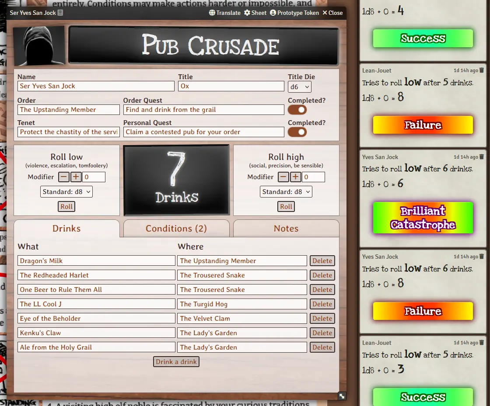

# Pub Crusade for Foundry VTT

A Foundry VTT System for the one-page tabletop RPG **[Pub Crusade](https://rowanrookanddecard.com/product/pub-crusade/?mc_cid=84e30af20e)** by Grant Howitt.

Pub Crusade is copyright... Grant Howitt, or Rowan, Rook,& Decard. Anyway the name is used (currently) without permission. This system does *not* contain the original 1-page rules for the game. It's just a little character sheet.

## How to use

For now: head to the [releases page](https://github.com/n3dst4/pub-crusade-fvtt/releases) and grab the manifest URL for the latest release.

Paste it into the manifest URL field in the Foundry VTT "install a system" dialog.

## Handy hints

* Create a scene with the one-page rules (which includes the "map") as the background image.
* Add the "Encounters" and "Inn-counters" tables as Foundry roll tables.
* Use [this d100 table](https://d100tables.com/t/tavern-drinks) to generate random drinks at each pub.
* Supplement the built-in d6 "Inn-counters" table with [this d100 table](https://d100tables.com/t/tavern-events).

## Other Acknowledgements

[Photograph by Rachel Kelli](https://unsplash.com/photos/brown-wooden-surface-with-white-textile-n7MMvJFAp8Q_) used under the [Unsplash license](https://unsplash.com/license).

[Love Ya Like A Sister](https://fonts.google.com/specimen/Love+Ya+Like+A+Sister) font by Kimberly Geswein, used under the [SIL Open Font License 1.1.](https://openfontlicense.org/.)

[Averia Libra](https://fonts.google.com/specimen/Averia+Libre?query=averia) font by Dan Sayers, used under the [SIL Open Font License 1.1.](https://openfontlicense.org/.)